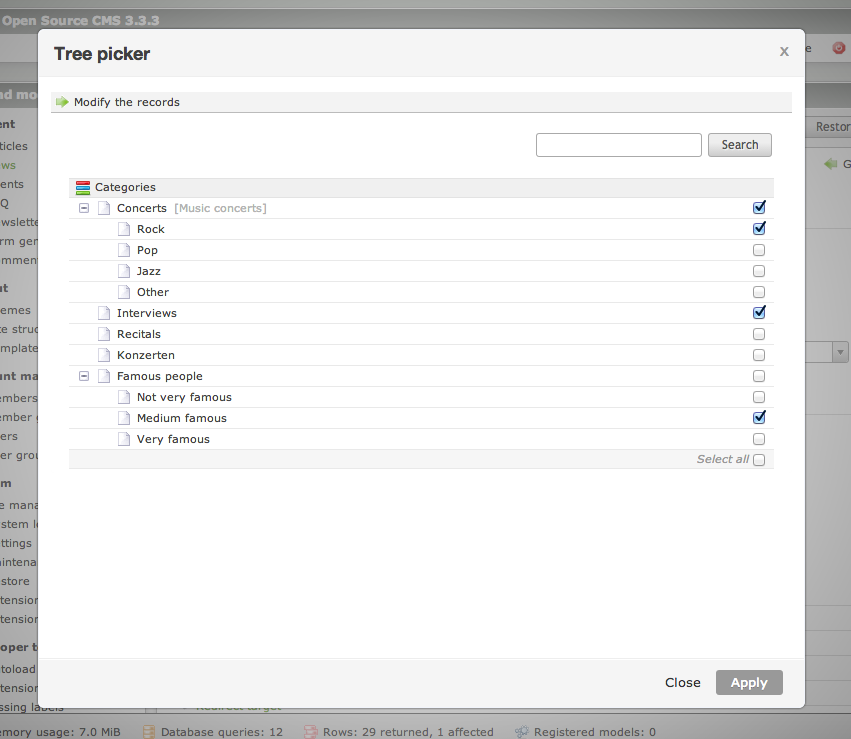

# THIS EXTENSION IS DEPRECATED

You should use the Picker features of Contao core instead.

---

# Widget Tree Picker extension for Contao Open Source CMS

Widget Tree Picker is an extension for the [Contao Open Source CMS](https://contao.org).

Contao widget that behaves similar to the page or file picker but allows you to choose any table as the source.

## Documentation

[Read the documentation](docs/README.md)

## Copyright

This project has been created and is maintained by [Codefog](https://codefog.pl).
